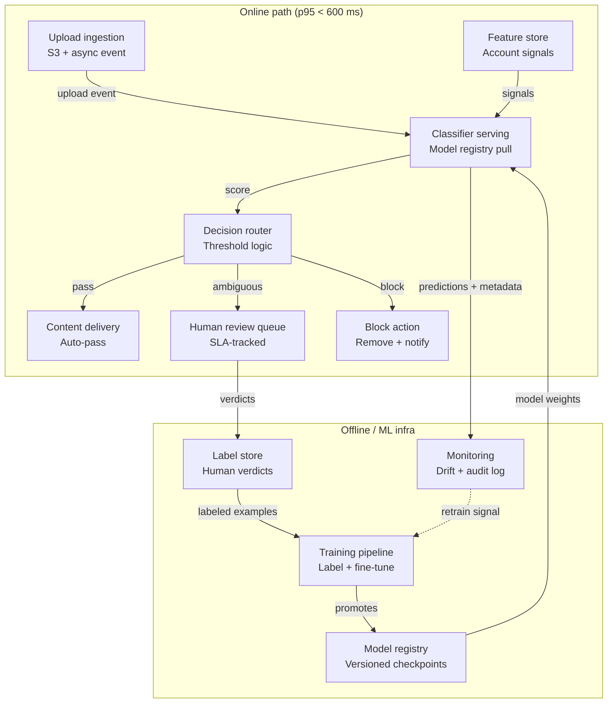

# Architecture — Scenario C: Image Moderation (UGC Platform)

## Serving boundary key

| Zone | Components |
|---|---|
| **Online** (p95 < 600 ms) | Upload ingestion, Classifier serving, Decision router, Content delivery, Block action |
| **Async online** | Human review queue (verdict returned later; upload is held) |
| **Offline** | Training pipeline, Model registry, Label store, Monitoring/drift detection |

## Diagram

## Component glossary

| Component | Responsibility |
|---|---|
| Upload ingestion | Receives multipart upload, stores raw image to S3, emits event to the scoring queue |
| Feature store | Provides per-account signals (e.g. account age, prior violation count) for model enrichment |
| Classifier serving | Loads the current champion model from the registry; runs inference; returns a confidence score + category flags |
| Decision router | Applies threshold logic: score < low_threshold → pass; score > high_threshold → block; else → queue for human |
| Human review queue | Holds ambiguous items; routes to a reviewer UI; enforces SLA; writes verdict back to label store |
| Model registry | Stores versioned model checkpoints with metadata (eval metrics, dataset version); serving pulls the "champion" tag |
| Training pipeline | Trains on images labeled by human review; promotes a new champion when challenger beats champion on held-out eval |
| Label store | Persistent store of (image_id, verdict, reviewer_id, timestamp) used as training signal |
| Monitoring | Tracks score distributions, false-positive rate on sampled reviewed cases, latency percentiles; emits drift alerts |

## Feedback loop

Monitoring detects distribution shift (e.g. a new category of prohibited content appearing) → triggers retrain signal → Training pipeline fine-tunes on recent labeled data from Label store → promotes new champion to Model registry → Classifier serving hot-reloads weights at next request cycle.
